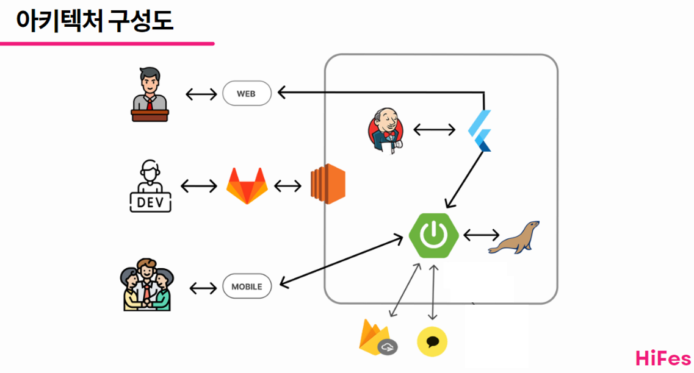

# 🎉 HIFES : Hi Festival 🎆

---

### 
 축제를 편리하게 안전하게 HIFES 

 

## 📖 목차

---

1. [기획 및 개발 기간](#기획-및-개발-기간)

2. [참여 인원](##👩‍💻-참여-인원)

3. [프로젝트 기획 배경](##프로젝트-기획-배경)

4. [주요 기능](##-주요-기능)

5. [기술 스택](#🎫-기술-스택)

6. [프로젝트 디자인](#🗂-프로젝트-디자인)

## 📅 기획 및 개발 기간

---

- 2023.07.10 ~ 2023.08.17 

## 👩‍💻 참여 인원

---

| 김도연    | 김진영    | 손준배 | 이현근    | 정예원 | [황하음](https://github.com/Hhaeum) |
| ------ | ------ | --- | ------ | --- | -------------------------------- |
| Mobile | Mobile | BE  | Web FE | BE  | BE                               |

## ✒ 프로젝트 기획 배경

---

- 종이 팜플렛 특유의 그래픽 지도는 종종 참여자들의 혼란을 야기하기도 합니다. 잘 가지고 다니면서 팜플렛에서 정보를 얻고자 할지라도 훼손되기 쉬운 종이 팜플렛은 행사장 구석에 뭉쳐져 굴러다니기 예사입니다. 
  
  - 저희는 팜플렛에 기재된 정보를 모바일로 옮김으로써 버려지는 종이 쓰레기를 줄이고자 했습니다.
  
  - 또한  gps를 통해 행사장의 여러 시설 위치와 본인의 위치를 한 눈에 보기 쉽게 만들고자 했습니다. 

- 코로나19의 대응이 단계적 일상 회복으로 접어듦에 따라, 행사와 축제에 대한 사람들의 관심이 몰리고 있습니다. 이에 안전사고에 대한 우려도 높아지는 실정에 실시간으로 축제 안전 사고 우려 알림을 보내 인구 과밀이나 설치물 훼손등에 따른 인명 피해를 줄이고자 했습니다.

- 행사에서 돌발상황이 발생했을 경우, 가령 스케쥴 변경이나 행사 취소, 배포물의 소진 알림은 행사장 내부의 스피커로 방송되고는 합니다. 그러나 이 방법은 대체로 스피커의 음질과 행사장 내부의 소음으로 한 번에 알아듣기 힘들 때가 많았습니다. 저희는 모바일로 바로바로 알림을 보내 행사 관광객의 이러한 불편을 해소하고자 했습니다.

## ✨ 주요 기능

---

🤹‍♀️ **행사 주최자**

- 지도 상에서 클릭을 통해 편리하게 행사 시설 위치를 등록할 수 있습니다.

- 엑셀파일 양식에 맞추어 일정 파일을 올리면 자동으로 서버 상에 행사 시간표가 등록됩니다.

- 공지사항에 게시글을 올리면 자동으로 축제를 팔로우하는 사람들에게 알림이 갑니다.

👩‍🎤 **행사 참여자**

- 자신 위치에서 반경 10km 내의 행사를 조회할 수 있습니다. 따라서 축제에 도착해서 앱을 실행했다면, 다른 검색을 하지 않고 바로 현재 축제의 알림을 받고 정보를 얻을 수 있습니다.

- 축제를 검색해서 근처에 있지 않는 행사 정보도 얻을 수 있습니다.

- 행사 시설 위치와 자신의 실시간 위치를 한 지도에서 확인할 수 있습니다.

- 행사 시간표와 시간에 따른 정보를 바로 확인할 수 있습니다.

- QR 코드를 통해 행사 참여 인증과 미션 인증을 할 수 있고, 이를 통해 발급된 티켓과 스탬프를 모으는 재미가 있습니다.

- 모임 기능을 통해, 새로운 사람들을 만나 행사에 참여할 수 있습니다.

- 해시태그를 통해 자신과 맞는 모임을 찾아 들어갈 수 있습니다.

- 모임 제목과 내용, 해시태그를 검색해서 원하는 모임을 찾을 수도 있습니다.

- 모임 집합콜 기능을 통해 모임 내의 다른 참가자들의 앱 내 지도에 집합 장소와 설명을 보낼 수 있습니다.

- 모임 채팅 기능을 통해, 앱을 나가지 않아도, 다른 앱에서 새로운 채팅방을 만들지 않아도 모임 사람들과 대화가 가능합니다.

## 🎫 기술 스택

---

**Front End**

- Kotlin

- Compose

- Firebase Realtime Database
  
  - 실시간 채팅 기능을 구현하기 위해 사용했습니다.

- Flutter SDK version 3.13.0

**Back End**

- Java Spring Boot 2.7.14
  
  - 호환성과 안정성을 고려하여 사용했습니다.

- mariaDB
  
  - 추후를 고려하면 다수의 데이터가 저장될 것으로 예상되어 사용했습니다.

- Firebase Cloud Messaging
  
  - 축제 참여자들의 기기에 실시간 푸시 알림을 보내기 위해 사용했습니다.

- AWS EC2 Ubuntu 20.04.3 LTS

## 🗂 프로젝트 디자인

---

